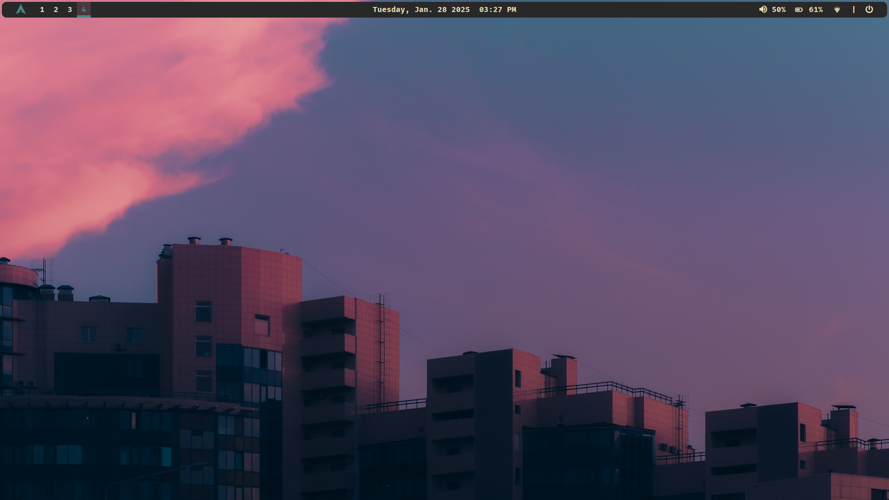
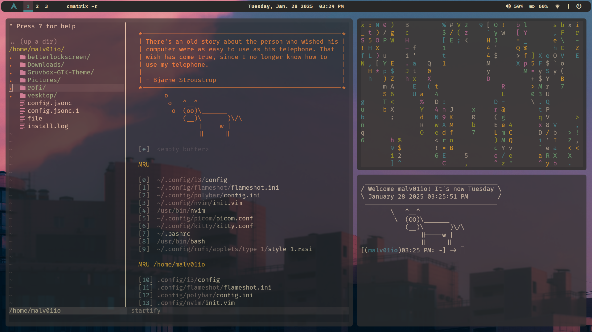
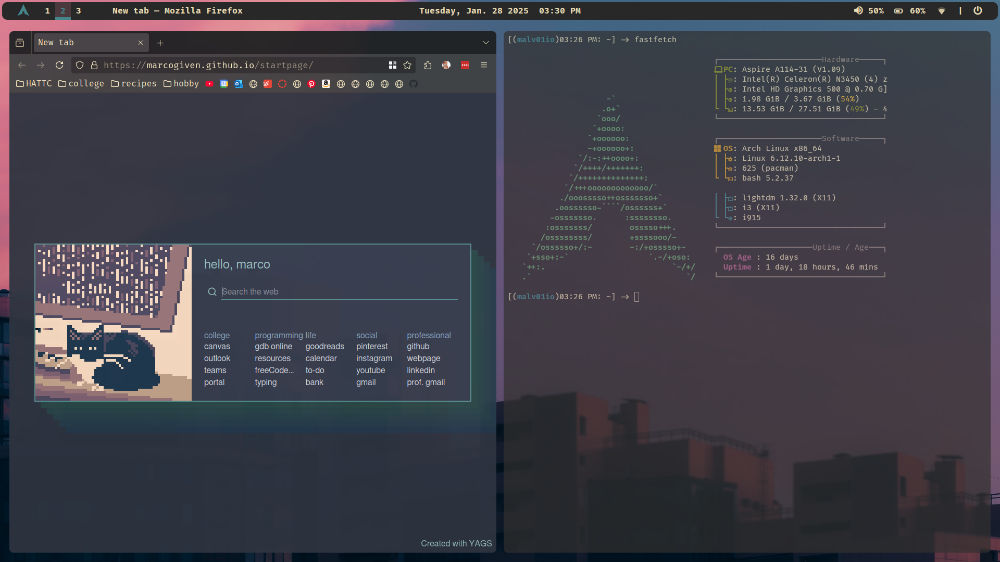

# Dotfiles
rice dotfiles for laptop running Arch Linux with i3, polybar, rofi, etc.

| Program Used | Name |
| --- | --- |
| distro | arch |
| wm | i3 |
| terminal | kitty |
| shell | bash |
| fetch | fastfetch |
| filemanager | thunar |
| text editor | nvim |
| colorscheme | gruvbox |
| font | FiraCode Nerd Font |
| lock screen | betterlockscreen |
| bar | polybar |
| wallpaper | feh |
| audio control | pulseaudio |
| discord client | vesktop/vencord |
| window switcher | Rofi |
| launcher/applets | [here](https://github.com/adi1090x/rofi?tab=readme-ov-file) |

## Screenshots

